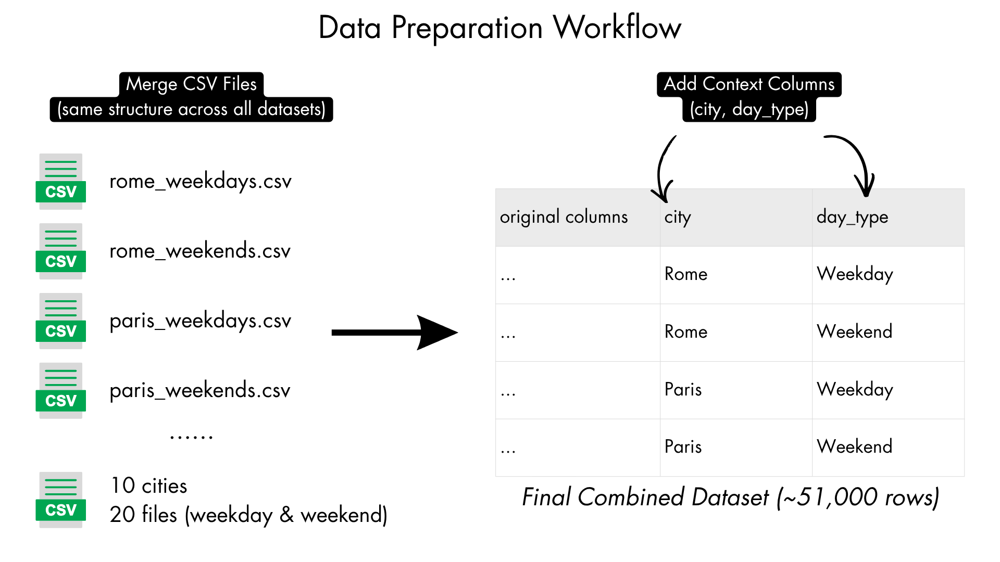
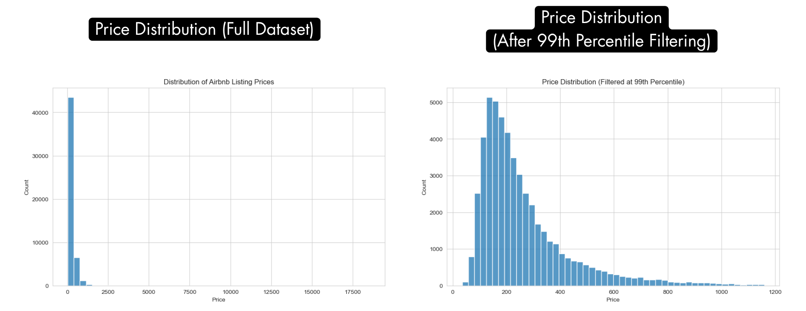
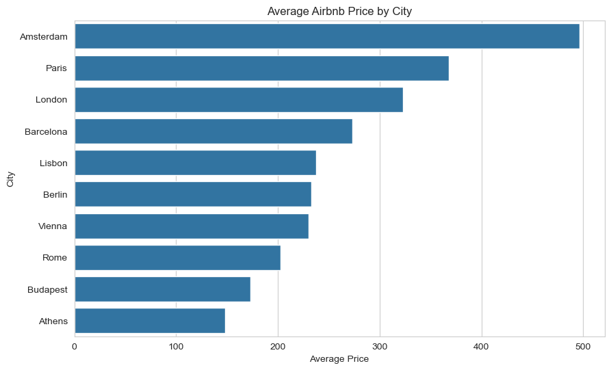
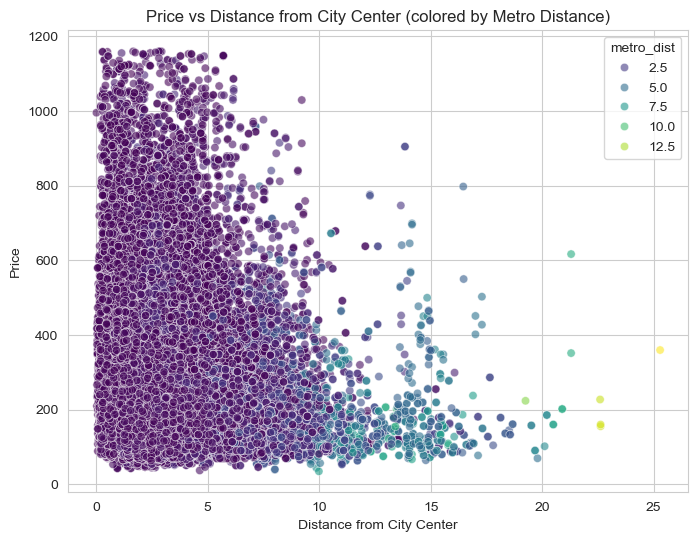
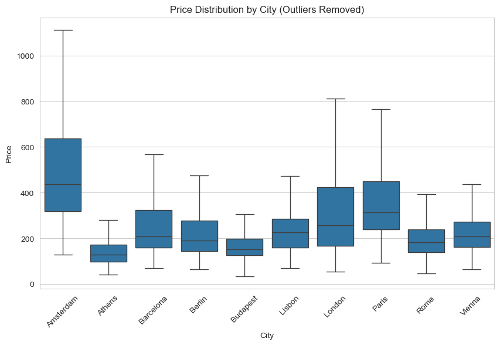

# Exploratory Data Analysis (EDA) of Airbnb Pricing Across European Cities

📊 Python EDA | 🏙️ Multi-City Analysis | 💡 Business Insights

---

## Executive Summary

This project explores Airbnb listing prices across major European cities using Python-based exploratory data analysis.

The goal was to understand what drives pricing differences, focusing on location, property characteristics, and timing (weekday vs weekend). The analysis was conducted using pandas, matplotlib, and seaborn in a Jupyter Notebook environment.

The results show that **location is the strongest driver of price**, particularly distance from the city center and proximity to metro stations. While property characteristics such as room type and capacity influence pricing, their impact is secondary.

Additionally, significant price differences exist across cities, suggesting that external factors such as local economies, tourism demand, and cost of living play a major role beyond the dataset.

---

## Notebook Preview

You can view the full analysis without running the code:

📄 [Open HTML version](notebooks/airbnb_pricing_eda.html)

---

## Business Problem

Airbnb hosts, investors, and analysts need to understand what drives listing prices in order to:

- Set competitive pricing strategies  
- Identify high-value markets  
- Optimize property features  
- Improve profitability  

This project analyzes pricing behavior across multiple cities to identify key drivers and support better decision-making.

---

## Dataset

The dataset includes Airbnb listings from 10 major European cities, split into weekday and weekend data.

- ~51,000 listings  
- 20+ variables  
- Mix of numerical, categorical, and boolean features  

Key features include:

- Price (`price`, originally `realSum`)  
- City  
- Room type  
- Guest capacity  
- Distance from city center  
- Distance from metro  
- Host characteristics (e.g. superhost status)  
- Guest satisfaction and cleanliness scores  

Source:  
https://www.kaggle.com/datasets/thedevastator/airbnb-prices-in-european-cities

---

## Data Cleaning & Preparation

Before analysis, several preparation steps were performed to ensure data quality and consistency:

- Combined multiple datasets (cities + weekday/weekend) into a single dataframe  
- Added contextual columns (`city`, `day_type`)  
- Renamed `realSum` column to `price` for clarity  
- Verified data types and structure  
- Checked for missing values (none detected)  
- Removed unnecessary columns (e.g. index fields)  

### Data Preparation Workflow

Multiple city-level datasets were combined into a single structured dataset, with additional contextual features enabling consistent cross-city analysis.

---

### Outlier Handling

Price distributions contained extreme values that could distort analysis.

- Initial analysis included full data  
- Subsequent analysis applied **99th percentile filtering** to reduce the impact of outliers  

This approach ensured both:
- accurate representation of real distributions  
- clearer visualization of general trends  

Extreme values heavily skew the distribution, making it difficult to interpret typical pricing behavior. After filtering the top 1%, the underlying structure becomes much clearer.

---

## Methodology

The project follows a structured Exploratory Data Analysis (EDA) approach:

- Data aggregation and grouping  
- Distribution analysis  
- Comparative analysis across cities  
- Relationship exploration between variables  
- Correlation analysis  

Key questions explored:

- How do prices vary across cities?  
- Does location influence pricing?  
- How do property characteristics affect price?  
- Is there a difference between weekday and weekend pricing?  

---

## Key Insights

- **Location is a key driver of price**  
  Listings closer to the city center and metro stations tend to have higher prices.

- **Prices vary significantly across cities**  
  Cities like Amsterdam and Paris are more expensive compared to others like Athens.

- **Room type strongly affects pricing**  
  Entire homes are priced higher than private or shared rooms.

- **Price distribution is highly skewed**  
  A small number of listings have extremely high prices, requiring outlier handling.

- **Guest capacity is positively related to price**  
  Larger listings tend to have higher prices, with increasing variability.

- **Superhosts tend to have slightly lower and more consistent prices**  
  Suggesting a more competitive and stable pricing strategy.

---

## Business Recommendations

- **Focus on location-based pricing strategies**  
  Adjust pricing based on proximity to city center and transport.

- **Optimize listings near metro stations**  
  Accessibility is a key value driver.

- **Segment pricing by city**  
  Avoid one-size-fits-all strategies.

- **Leverage room type positioning**  
  Entire homes as premium, private/shared as competitive options.

- **Use guest capacity strategically**  
  Larger listings should justify pricing with value.

- **Encourage superhost practices**  
  Better service can support stronger positioning.

---

## Visualizations

The analysis includes a set of visualizations to explore pricing patterns:

- Price distribution (before and after outlier filtering)  
- Average price by city  
- Weekday vs weekend comparisons  
- Price distribution by city  
- Price distribution by room type  
- Price vs distance from city center  
- Price vs metro distance  
- Price vs guest capacity  
- Price by superhost status  
- Correlation heatmap  

### Key Visual Examples

#### Average Price by City

Significant pricing differences exist across cities, with some markets consistently more expensive than others.

#### Price vs Distance from City Center & Metro

Prices decrease as distance from the city center and metro increases, highlighting the importance of location and accessibility.

#### Price Distribution by City

Price distributions vary widely across cities, with some showing higher variability and premium listings.

---

## Limitations

- External factors (income levels, tourism, cost of living) are not included  
- No booking or occupancy data available  
- Outlier filtering improves clarity but removes extreme cases  
- Results show correlation, not causation  
- Some city-level differences remain unexplained  

---

## Next Steps

- Add seasonality analysis  
- Include booking/occupancy data  
- Combine with external datasets  
- Build predictive pricing models  
- Develop an interactive dashboard  

---

## Data Dictionary

A detailed data dictionary is available in the project files:

[data_dictionary.xlsx](docs/data_dictionary.xlsx)

---

## How to Reproduce

The analysis was conducted in a Jupyter Notebook using Python (pandas, matplotlib, seaborn).  
Running the notebook will reproduce all steps and visualizations.

---

## Skills Demonstrated

- Python (pandas, matplotlib, seaborn)
- Data cleaning and preprocessing
- Exploratory Data Analysis (EDA)
- Data visualization
- Outlier detection and handling
